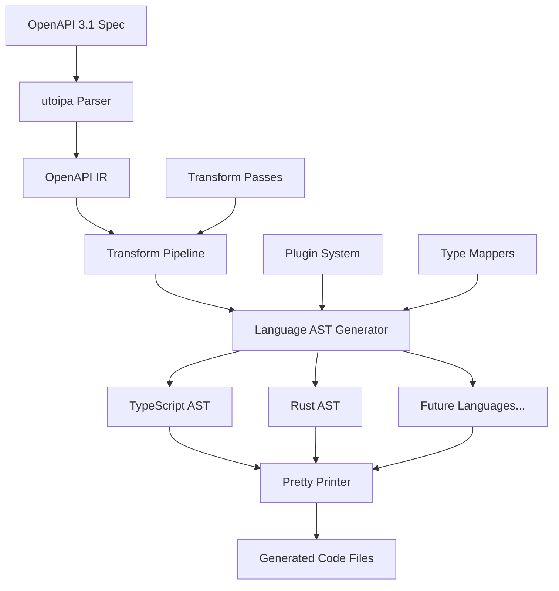

# RFD 0001: Overall Architecture and Design Philosophy

## Summary

This RFD defines the overall architecture and design philosophy for the OpenAPI 3.1 code generator, inspired by LLVM/Clang design principles. The architecture emphasizes modularity, extensibility, and correctness through a multi-stage pipeline with language-specific ASTs and transformation passes.

## Motivation

Traditional OpenAPI code generators often suffer from:
- Monolithic designs that are hard to extend
- Poor separation of concerns between parsing, transformation, and code generation
- Limited support for custom transformations and optimizations
- Inconsistent code quality and formatting
- Difficulty in adding new target languages

Our architecture addresses these issues by adopting proven patterns from compiler design, specifically LLVM's modular pass system and Clang's AST-based approach.

## Design Philosophy

### 1. Modularity and Separation of Concerns

Each component has a single, well-defined responsibility:

- **Parser**: Converts OpenAPI spec to internal representation
- **IR Layer**: Provides utilities for working with OpenAPI types
- **Transform Passes**: Apply transformations at multiple levels
- **AST Generators**: Convert to language-specific ASTs
- **Emitters**: Generate formatted code from ASTs

### 2. Extensibility Through Plugins

The system is designed to be easily extensible:

- New languages can be added by implementing the AST generator trait
- Custom transformation passes can be plugged in
- Type mapping strategies can be customized
- Code generation templates can be overridden

### 3. Correctness and Type Safety

- Strong typing throughout the pipeline using Rust's type system
- AST validation ensures well-formed generated code
- Comprehensive error handling with source location tracking
- Extensive testing at each pipeline stage

### 4. Performance and Scalability

- Lazy evaluation where possible
- Parallel processing of independent operations
- Efficient memory usage through reference-based ASTs
- Incremental processing for large specifications

## High-Level Architecture



## Pipeline Stages

### 1. Parse Stage

- **Input**: OpenAPI 3.1 YAML/JSON specification
- **Output**: utoipa `OpenApi` structure
- **Component**: `openapi-nexus-parser`
- **Responsibilities**:
  - Parse and validate OpenAPI spec
  - Handle references and external documents
  - Provide error reporting with source locations

### 2. Transform Stage

- **Input**: utoipa `OpenApi` structure
- **Output**: Transformed `OpenApi` structure
- **Component**: `openapi-nexus-transforms`
- **Responsibilities**:
  - Apply normalization passes
  - Resolve references and dependencies
  - Apply semantic analysis
  - Optimize for code generation

### 3. Generate AST Stage

- **Input**: Transformed `OpenApi` structure
- **Output**: Language-specific AST
- **Components**: `openapi-nexus-typescript`, `openapi-nexus-rust`
- **Responsibilities**:
  - Convert OpenAPI schemas to language types
  - Generate API client structures
  - Create utility types and helpers
  - Apply language-specific optimizations

### 4. Emit Stage

- **Input**: Language-specific AST
- **Output**: Formatted source code files
- **Component**: Language-specific emitters using `pretty.rs`
- **Responsibilities**:
  - Convert AST to pretty-printed code
  - Generate multiple output files
  - Apply language-specific formatting rules
  - Handle imports and module organization

## Crate Organization

### Core Crates

- **`openapi-nexus-core`**: Common types, configuration, and error handling
- **`openapi-nexus-parser`**: OpenAPI specification parsing using utoipa
- **`openapi-nexus-ir`**: Intermediate representation utilities and helpers
- **`openapi-nexus-transforms`**: Transformation pass framework and built-in passes

### Language-Specific Crates

- **`openapi-nexus-typescript`**: TypeScript AST and code generation
- **`openapi-nexus-rust`**: Rust AST and code generation
- **Future**: `openapi-nexus-python`, `openapi-nexus-go`, etc.

### Plugin and Extension Crates

- **`openapi-nexus-plugin`**: Plugin system traits and registry

### Test Crates

- **`openapi-nexus-petstore-example`**: The petstore OpenAPI 3.1.0 specification based example generator.

### Main Application

- **`openapi-nexus`**: CLI application and main entry point

## Key Architectural Principles

### 1. Single Responsibility Principle

Each crate and module has one clear purpose:

- Parsing is separate from transformation
- AST generation is separate from code emission
- Language-specific logic is isolated in dedicated crates

### 2. Dependency Inversion

High-level modules don't depend on low-level modules:

- Core types are defined in `openapi-nexus-core`
- Language generators depend on core, not vice versa
- Plugins implement traits defined in core

### 3. Open/Closed Principle

The system is open for extension but closed for modification:

- New languages can be added without changing existing code
- New transformation passes can be plugged in
- Custom type mappers can be registered

### 4. Interface Segregation

Clients depend only on interfaces they use:

- Language generators only implement what they need
- Transform passes have minimal, focused interfaces
- Plugin traits are specific to their use case

## Comparison with Traditional Code Generators

### Traditional Approach

```
OpenAPI Spec → Template Engine → Generated Code
```

**Problems**:

- Tight coupling between spec format and output
- Limited transformation capabilities
- Hard to test individual components
- Difficult to add new languages

### Our Approach

```text
OpenAPI Spec → Parse → Transform → AST → Emit → Generated Code
```

**Benefits**:

- Clear separation of concerns
- Rich transformation capabilities
- Easy to test each stage
- Simple to add new languages
- Reusable components

## Error Handling Strategy

### Error Types Hierarchy

```rust
pub enum Error {
    Parse(ParseError),
    Transform(TransformError),
    Generate(GenerateError),
    Emit(EmitError),
    Config(ConfigError),
}
```

### Source Location Tracking

All errors include source location information:

- File path and line/column numbers
- OpenAPI path references
- AST node locations
- Transformation pass context

### Recovery Strategies

- **Parse errors**: Fail fast with detailed diagnostics
- **Transform errors**: Attempt recovery where possible, report warnings
- **Generate errors**: Provide suggestions for fixes
- **Emit errors**: Fall back to basic formatting

## Configuration and Customization

### Generator Configuration

```rust
pub struct GeneratorConfig {
    pub output_dir: PathBuf,
    pub languages: Vec<String>,
    pub create_subdirs: bool,
    pub overwrite: bool,
    pub transform_passes: Vec<String>,
    pub type_mappings: HashMap<String, String>,
    pub formatting: FormattingConfig,
}
```

### Language-Specific Options

Each language generator can define its own configuration options:

- TypeScript: strict mode, module system, decorators
- Rust: edition, features, crate organization
- Future languages: their specific requirements

## Future Extensibility

### Adding New Languages

1. Create new crate: `openapi-nexus-{language}`
2. Implement `LanguageGenerator` trait
3. Define language-specific AST types
4. Implement type mapping from OpenAPI to language types
5. Create pretty printer for the language
6. Register with plugin system

### Adding New Transform Passes

1. Implement `TransformPass` trait
2. Define pass-specific configuration
3. Add to built-in passes or create plugin
4. Register with transform pipeline

### Custom Type Mappings

1. Implement `TypeMapper` trait
2. Define custom mapping rules
3. Register with language generator
4. Use in code generation

## Conclusion

This architecture provides a solid foundation for a modern, extensible OpenAPI code generator. By adopting proven compiler design patterns and leveraging Rust's type system, we can create a tool that is both powerful and maintainable.

The modular design allows for incremental development and easy extension, while the clear separation of concerns makes the codebase easier to understand and test.

## Related RFDs

- [RFD 0002: OpenAPI Parsing with utoipa](./0002-openapi-parsing.md)
- [RFD 0003: Language-Specific AST Design](./0003-language-ast-design.md)
- [RFD 0004: Multi-Level Transformation Passes](./0004-transformation-passes.md)
- [RFD 0008: Plugin System and Extensibility](./0008-plugin-system.md)
