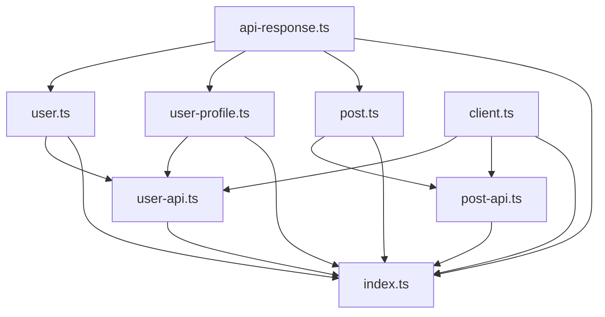

# RFD 0006: Multi-File Emission Strategy

## Summary

This RFD defines the multi-file emission strategy for organizing generated code into logical, maintainable files. The system generates separate files for models, API endpoints, client wrappers, and utility types, with proper module organization and cross-file references.

## Motivation

### Why Multi-File Emission?

1. **Maintainability**: Smaller, focused files are easier to understand and maintain
2. **Modularity**: Different parts of the API can be imported independently
3. **Organization**: Logical separation of concerns improves code organization
4. **Performance**: Smaller files load faster and enable better tree-shaking

### Design Goals

- **Logical Separation**: Group related functionality into appropriate files
- **Import Management**: Handle imports and exports correctly
- **Dependency Resolution**: Resolve cross-file dependencies automatically
- **Configurability**: Allow customization of file organization
- **Language Idioms**: Follow language-specific conventions for file organization

## File Organization Strategy

### Granular File Organization

Each model/schema lives in its own file for maximum modularity and maintainability:

#### 1. Individual Model Files

Each OpenAPI schema becomes its own file:

```typescript
// user.ts
export interface User {
  id: number;
  name: string;
  email: string;
  profile?: UserProfile;
}
```

```typescript
// user-profile.ts
export interface UserProfile {
  firstName: string;
  lastName: string;
  avatar?: string;
}
```

```typescript
// create-user-request.ts
export interface CreateUserRequest {
  name: string;
  email: string;
  profile?: Partial<UserProfile>;
}
```

#### 2. Individual API Endpoint Files

Each API endpoint group gets its own file:

```typescript
// user-api.ts
import { User, CreateUserRequest, UpdateUserRequest } from './user';
import { UserProfile } from './user-profile';
import { ApiClient } from './client';

export class UserApi {
  constructor(private client: ApiClient) {}
  
  async getUsers(): Promise<User[]> {
    return this.client.get<User[]>('/users');
  }
  
  async getUser(id: number): Promise<User> {
    return this.client.get<User>(`/users/${id}`);
  }
  
  async createUser(user: CreateUserRequest): Promise<User> {
    return this.client.post<User>('/users', user);
  }
}
```

```typescript
// post-api.ts
import { Post, CreatePostRequest } from './post';
import { Comment } from './comment';
import { ApiClient } from './client';

export class PostApi {
  constructor(private client: ApiClient) {}
  
  async getPosts(): Promise<Post[]> {
    return this.client.get<Post[]>('/posts');
  }
  
  async createPost(post: CreatePostRequest): Promise<Post> {
    return this.client.post<Post>('/posts', post);
  }
}
```

#### 3. Individual Utility Type Files

Each utility type gets its own file:

```typescript
// api-response.ts
export type ApiResponse<T> = {
  data: T;
  status: number;
  statusText: string;
};
```

```typescript
// api-error.ts
export class ApiError extends Error {
  constructor(
    public status: number,
    message: string,
    public details?: any
  ) {
    super(message);
    this.name = 'ApiError';
  }
  
  static fromResponse(response: Response): ApiError {
    return new ApiError(
      response.status,
      `HTTP ${response.status}: ${response.statusText}`,
      { url: response.url }
    );
  }
  
  static fromNetworkError(error: Error): ApiError {
    return new ApiError(0, `Network error: ${error.message}`, { originalError: error });
  }
}
```

```typescript
// request-config.ts
export interface RequestConfig extends RequestInit {
  timeout?: number;
  headers?: Record<string, string>;
}
```

#### 4. HTTP Client File (`client.ts/rs`)

Contains HTTP client wrapper using native fetch API:

```typescript
// client.ts
import { ApiResponse } from './api-response';
import { ApiError } from './api-error';
import { RequestConfig } from './request-config';

export class ApiClient {
  constructor(
    private baseURL: string,
    private defaultConfig: RequestConfig = {}
  ) {}
  
  async get<T>(path: string, config?: RequestConfig): Promise<T> {
    const response = await this.request<T>(path, {
      method: 'GET',
      ...config,
    });
    return response.data;
  }
  
  async post<T>(path: string, data?: any, config?: RequestConfig): Promise<T> {
    const response = await this.request<T>(path, {
      method: 'POST',
      body: data ? JSON.stringify(data) : undefined,
      ...config,
    });
    return response.data;
  }
  
  async put<T>(path: string, data?: any, config?: RequestConfig): Promise<T> {
    const response = await this.request<T>(path, {
      method: 'PUT',
      body: data ? JSON.stringify(data) : undefined,
      ...config,
    });
    return response.data;
  }
  
  async delete<T>(path: string, config?: RequestConfig): Promise<T> {
    const response = await this.request<T>(path, {
      method: 'DELETE',
      ...config,
    });
    return response.data;
  }
  
  private async request<T>(path: string, config: RequestConfig): Promise<ApiResponse<T>> {
    const url = `${this.baseURL}${path}`;
    const headers = {
      'Content-Type': 'application/json',
      ...this.defaultConfig.headers,
      ...config.headers,
    };
    
    // Handle timeout with AbortController
    const controller = new AbortController();
    const timeout = config.timeout || this.defaultConfig.timeout || 5000;
    
    const timeoutId = setTimeout(() => {
      controller.abort();
    }, timeout);
    
    try {
      const response = await fetch(url, {
        method: config.method || 'GET',
        headers,
        body: config.body,
        signal: controller.signal,
        ...this.defaultConfig,
        ...config,
      });
      
      clearTimeout(timeoutId);
      
      if (!response.ok) {
        throw ApiError.fromResponse(response);
      }
      
      const data = await response.json();
      
      return {
        data,
        status: response.status,
        statusText: response.statusText,
      };
    } catch (error) {
      clearTimeout(timeoutId);
      
      if (error instanceof ApiError) {
        throw error;
      }
      
      if (error.name === 'AbortError') {
        throw new ApiError(0, `Request timeout after ${timeout}ms`);
      }
      
      throw ApiError.fromNetworkError(error);
    }
  }
}
```

### Additional File Types

#### 5. Index File (`index.ts/rs`)

Main entry point that exports everything:

```typescript
// index.ts
// Export all models
export * from './user';
export * from './user-profile';
export * from './post';
export * from './comment';

// Export all API classes
export * from './user-api';
export * from './post-api';

// Export client and utilities
export * from './client';
export * from './api-response';
export * from './api-error';
export * from './request-config';

// Re-export main classes for convenience
export { ApiClient } from './client';
export { UserApi } from './user-api';
export { PostApi } from './post-api';
```

#### 6. Configuration File (`config.ts/rs`)

Configuration and constants:

```typescript
// config.ts
export const API_CONFIG = {
  baseURL: process.env.API_BASE_URL || 'https://api.example.com',
  timeout: 5000,
  retries: 3,
  headers: {
    'Accept': 'application/json',
    'User-Agent': 'OpenAPI-Generated-Client/1.0.0',
  },
};

export const ENDPOINTS = {
  USERS: '/users',
  POSTS: '/posts',
  COMMENTS: '/comments',
} as const;
```

### Rust Granular File Organization

#### Individual Model Files

```rust
// user.rs
use serde::{Deserialize, Serialize};

#[derive(Debug, Clone, Serialize, Deserialize)]
pub struct User {
    pub id: u64,
    pub name: String,
    pub email: String,
    pub profile: Option<UserProfile>,
}
```

```rust
// user_profile.rs
use serde::{Deserialize, Serialize};

#[derive(Debug, Clone, Serialize, Deserialize)]
pub struct UserProfile {
    pub first_name: String,
    pub last_name: String,
    pub avatar: Option<String>,
}
```

#### Individual API Files

```rust
// user_api.rs
use crate::models::{User, CreateUserRequest};
use crate::client::ApiClient;
use crate::error::ApiError;

pub struct UserApi {
    client: ApiClient,
}

impl UserApi {
    pub fn new(client: ApiClient) -> Self {
        Self { client }
    }
    
    pub async fn get_users(&self) -> Result<Vec<User>, ApiError> {
        self.client.get("/users").await
    }
    
    pub async fn get_user(&self, id: u64) -> Result<User, ApiError> {
        self.client.get(&format!("/users/{}", id)).await
    }
    
    pub async fn create_user(&self, user: CreateUserRequest) -> Result<User, ApiError> {
        self.client.post("/users", user).await
    }
}
```

#### Individual Utility Files

```rust
// api_response.rs
use serde::{Deserialize, Serialize};

#[derive(Debug, Clone, Serialize, Deserialize)]
pub struct ApiResponse<T> {
    pub data: T,
    pub status: u16,
    pub status_text: String,
}
```

```rust
// api_error.rs
use serde::{Deserialize, Serialize};

#[derive(Debug, Clone, Serialize, Deserialize)]
pub struct ApiError {
    pub message: String,
    pub status: u16,
    pub details: Option<serde_json::Value>,
}
```

## Module Organization

### TypeScript Module System

#### ES Modules (ESM)

```typescript
// user.ts
export interface User {
  id: number;
  name: string;
}

// user-api.ts
import { User } from './user.js';
import { ApiClient } from './client.js';

export class UserApi {
  // ...
}
```

#### CommonJS

```typescript
// user.ts
export interface User {
  id: number;
  name: string;
}

// user-api.ts
import { User } from './user';
import { ApiClient } from './client';

export class UserApi {
  // ...
}
```

### Rust Module System

#### Crate Organization

```rust
// lib.rs
pub mod models;
pub mod api;
pub mod client;
pub mod error;

// Re-export individual modules
pub use models::user::User;
pub use models::user_profile::UserProfile;
pub use api::user_api::UserApi;
pub use client::ApiClient;
pub use error::ApiError;

// models/mod.rs
pub mod user;
pub mod user_profile;
pub mod post;
pub mod comment;

// api/mod.rs
pub mod user_api;
pub mod post_api;

// models/user.rs
#[derive(Debug, Clone, Serialize, Deserialize)]
pub struct User {
    pub id: u64,
    pub name: String,
    pub email: String,
}

// api/user_api.rs
use crate::models::user::User;
use crate::client::ApiClient;

pub struct UserApi {
    client: ApiClient,
}

impl UserApi {
    pub async fn get_users(&self) -> Result<Vec<User>, ApiError> {
        self.client.get("/users").await
    }
}
```

## File Naming Conventions

### TypeScript Conventions

- **Files**: `kebab-case.ts` (e.g., `user-profile.ts`, `create-user-request.ts`)
- **Classes**: `PascalCase` (e.g., `UserApi`, `ApiClient`)
- **Interfaces**: `PascalCase` (e.g., `User`, `CreateUserRequest`)
- **Functions**: `camelCase` (e.g., `getUser`, `createUser`)
- **Constants**: `UPPER_SNAKE_CASE` (e.g., `API_BASE_URL`)

### Rust Conventions

- **Files**: `snake_case.rs` (e.g., `user_profile.rs`, `create_user_request.rs`)
- **Structs**: `PascalCase` (e.g., `User`, `CreateUserRequest`)
- **Functions**: `snake_case` (e.g., `get_user`, `create_user`)
- **Constants**: `UPPER_SNAKE_CASE` (e.g., `API_BASE_URL`)

### File Organization Patterns

#### By Schema Name
Each OpenAPI schema becomes a file named after the schema:
- `User` schema → `user.ts/rs`
- `UserProfile` schema → `user-profile.ts` / `user_profile.rs`
- `CreateUserRequest` schema → `create-user-request.ts` / `create_user_request.rs`

#### By API Tag
Group related endpoints by OpenAPI tags:
- `users` tag → `user-api.ts/rs`
- `posts` tag → `post-api.ts/rs`
- `comments` tag → `comment-api.ts/rs`

#### By Functionality
Group related utilities:
- Response types → `api-response.ts/rs`
- Error types → `api-error.ts/rs`
- Configuration → `config.ts/rs`

## Cross-File References and Dependencies

### Dependency Graph



### Dependency Resolution

```rust
pub struct FileDependencyResolver {
    files: HashMap<String, FileInfo>,
    dependencies: HashMap<String, Vec<String>>,
}

#[derive(Debug, Clone)]
pub struct FileInfo {
    pub name: String,
    pub content: String,
    pub dependencies: Vec<String>,
    pub exports: Vec<String>,
}

impl FileDependencyResolver {
    pub fn resolve_dependencies(&self) -> Result<Vec<String>, DependencyError> {
        // Topological sort of files based on dependencies
        // Ensure no circular dependencies
        // Return ordered list of files
    }
}
```

### Import Generation

```rust
pub struct ImportGenerator {
    base_path: PathBuf,
    module_system: ModuleSystem,
}

impl ImportGenerator {
    pub fn generate_imports(&self, file: &FileInfo) -> String {
        let mut imports = String::new();
        
        for dependency in &file.dependencies {
            let import_path = self.calculate_import_path(dependency);
            let import_statement = self.generate_import_statement(dependency, &import_path);
            imports.push_str(&import_statement);
        }
        
        imports
    }
}
```

## Configuration Options

### File Organization Configuration

```rust
#[derive(Debug, Clone)]
pub struct FileOrganizationConfig {
    pub output_dir: PathBuf,
    pub file_naming: FileNamingConvention,
    pub module_system: ModuleSystem,
    pub include_index_file: bool,
    pub include_config_file: bool,
    pub granular_files: bool, // Each schema gets its own file
    pub group_by_tag: bool,    // Group API endpoints by OpenAPI tags
    pub custom_file_mappings: HashMap<String, String>,
}

#[derive(Debug, Clone)]
pub enum FileNamingConvention {
    KebabCase,
    SnakeCase,
    CamelCase,
    PascalCase,
}

#[derive(Debug, Clone)]
pub enum ModuleSystem {
    EsModules,
    CommonJs,
    Umd,
    Amd,
}
```

### Language-Specific Configuration

#### TypeScript Configuration

```rust
#[derive(Debug, Clone)]
pub struct TypeScriptFileConfig {
    pub base_config: FileOrganizationConfig,
    pub use_strict_mode: bool,
    pub target_version: String,
    pub module_resolution: ModuleResolution,
    pub include_declarations: bool,
}

#[derive(Debug, Clone)]
pub enum ModuleResolution {
    Node,
    Classic,
    Bundler,
}
```

#### Rust Configuration

```rust
#[derive(Debug, Clone)]
pub struct RustFileConfig {
    pub base_config: FileOrganizationConfig,
    pub edition: RustEdition,
    pub crate_name: String,
    pub include_cargo_toml: bool,
    pub include_readme: bool,
}

#[derive(Debug, Clone)]
pub enum RustEdition {
    Edition2018,
    Edition2021,
    Edition2024,
}
```

## File Generation Pipeline

### File Generator Trait

```rust
pub trait FileGenerator {
    type FileType;
    type Error;
    
    fn generate_files(&self, ast: &[Self::FileType]) -> Result<Vec<GeneratedFile>, Self::Error>;
    fn generate_file(&self, content: &str, filename: &str) -> Result<GeneratedFile, Self::Error>;
    fn organize_files(&self, files: Vec<GeneratedFile>) -> Result<FileOrganization, Self::Error>;
}

#[derive(Debug, Clone)]
pub struct GeneratedFile {
    pub name: String,
    pub content: String,
    pub dependencies: Vec<String>,
    pub file_type: FileType,
}

#[derive(Debug, Clone)]
pub enum FileType {
    Models,
    Api,
    Client,
    Types,
    Index,
    Config,
    Custom(String),
}
```

### File Organization

```rust
pub struct FileOrganizer {
    config: FileOrganizationConfig,
    dependency_resolver: FileDependencyResolver,
}

impl FileOrganizer {
    pub fn organize_files(&self, files: Vec<GeneratedFile>) -> Result<FileOrganization, OrganizationError> {
        // Group files by type
        let grouped_files = self.group_files_by_type(files);
        
        // Resolve dependencies
        let dependency_order = self.dependency_resolver.resolve_dependencies()?;
        
        // Create file organization
        Ok(FileOrganization {
            files: grouped_files,
            dependency_order,
            index_file: self.generate_index_file(&grouped_files)?,
        })
    }
}
```

## Language-Specific Implementations

### TypeScript File Generator

```rust
impl FileGenerator for TypeScriptFileGenerator {
    type FileType = TsNode;
    type Error = TypeScriptFileError;
    
    fn generate_files(&self, ast: &[TsNode]) -> Result<Vec<GeneratedFile>, TypeScriptFileError> {
        let mut files = Vec::new();
        
        if self.config.granular_files {
            // Generate individual files for each schema/API
            let models = self.extract_models(ast);
            let api_methods = self.extract_api_methods(ast);
            let utility_types = self.extract_utility_types(ast);
            
            // Generate individual model files
            for model in models {
                files.push(self.generate_individual_model_file(&model)?);
            }
            
            // Generate individual API files (grouped by tag if configured)
            if self.config.group_by_tag {
                let api_groups = self.group_api_methods_by_tag(api_methods);
                for (tag, methods) in api_groups {
                    files.push(self.generate_tag_api_file(&tag, &methods)?);
                }
            } else {
                for api_method in api_methods {
                    files.push(self.generate_individual_api_file(&api_method)?);
                }
            }
            
            // Generate individual utility type files
            for utility_type in utility_types {
                files.push(self.generate_individual_utility_file(&utility_type)?);
            }
            
            // Generate client file
            files.push(self.generate_client_file()?);
            
        } else {
            // Generate grouped files (legacy behavior)
            let models = self.extract_models(ast);
            let api_methods = self.extract_api_methods(ast);
            let client_code = self.extract_client_code(ast);
            let utility_types = self.extract_utility_types(ast);
            
            if !models.is_empty() {
                files.push(self.generate_models_file(&models)?);
            }
            
            if !api_methods.is_empty() {
                files.push(self.generate_api_file(&api_methods)?);
            }
            
            if !client_code.is_empty() {
                files.push(self.generate_client_file(&client_code)?);
            }
            
            if !utility_types.is_empty() {
                files.push(self.generate_types_file(&utility_types)?);
            }
        }
        
        // Generate index file
        files.push(self.generate_index_file(&files)?);
        
        Ok(files)
    }
}
```

### Rust File Generator

```rust
impl FileGenerator for RustFileGenerator {
    type FileType = RustNode;
    type Error = RustFileError;
    
    fn generate_files(&self, ast: &[RustNode]) -> Result<Vec<GeneratedFile>, RustFileError> {
        let mut files = Vec::new();
        
        if self.config.granular_files {
            // Generate individual files for each schema/API
            let models = self.extract_models(ast);
            let api_methods = self.extract_api_methods(ast);
            let utility_types = self.extract_utility_types(ast);
            
            // Generate individual model files
            for model in models {
                files.push(self.generate_individual_model_file(&model)?);
            }
            
            // Generate individual API files (grouped by tag if configured)
            if self.config.group_by_tag {
                let api_groups = self.group_api_methods_by_tag(api_methods);
                for (tag, methods) in api_groups {
                    files.push(self.generate_tag_api_file(&tag, &methods)?);
                }
            } else {
                for api_method in api_methods {
                    files.push(self.generate_individual_api_file(&api_method)?);
                }
            }
            
            // Generate individual utility type files
            for utility_type in utility_types {
                files.push(self.generate_individual_utility_file(&utility_type)?);
            }
            
            // Generate client file
            files.push(self.generate_client_file()?);
            
        } else {
            // Generate grouped files (legacy behavior)
            let models = self.extract_models(ast);
            let api_methods = self.extract_api_methods(ast);
            let client_code = self.extract_client_code(ast);
            let utility_types = self.extract_utility_types(ast);
            
            if !models.is_empty() {
                files.push(self.generate_models_file(&models)?);
            }
            
            if !api_methods.is_empty() {
                files.push(self.generate_api_file(&api_methods)?);
            }
            
            if !client_code.is_empty() {
                files.push(self.generate_client_file(&client_code)?);
            }
            
            if !utility_types.is_empty() {
                files.push(self.generate_types_file(&utility_types)?);
            }
        }
        
        // Generate lib.rs
        files.push(self.generate_lib_file(&files)?);
        
        // Generate Cargo.toml if configured
        if self.config.include_cargo_toml {
            files.push(self.generate_cargo_toml()?);
        }
        
        Ok(files)
    }
}
```

## Advanced File Organization

### Tag-Based Organization

Organize files by OpenAPI tags:

```rust
pub struct TagBasedOrganizer {
    config: FileOrganizationConfig,
}

impl TagBasedOrganizer {
    pub fn organize_by_tags(&self, openapi: &OpenApi) -> Result<FileOrganization, OrganizationError> {
        let mut tag_files = HashMap::new();
        
        // Group operations by tags
        for (path, path_item) in &openapi.paths {
            for (method, operation) in path_item.operations() {
                if let Some(tags) = &operation.tags {
                    for tag in tags {
                        let tag_file = tag_files.entry(tag.clone()).or_insert_with(Vec::new);
                        tag_file.push((path.clone(), method, operation.clone()));
                    }
                }
            }
        }
        
        // Generate files for each tag
        let mut files = Vec::new();
        for (tag, operations) in tag_files {
            let file = self.generate_tag_file(&tag, &operations)?;
            files.push(file);
        }
        
        Ok(FileOrganization {
            files,
            dependency_order: self.resolve_dependencies(&files)?,
            index_file: self.generate_index_file(&files)?,
        })
    }
}
```

### Path-Based Organization

Organize files by API path structure:

```rust
pub struct PathBasedOrganizer {
    config: FileOrganizationConfig,
}

impl PathBasedOrganizer {
    pub fn organize_by_paths(&self, openapi: &OpenApi) -> Result<FileOrganization, OrganizationError> {
        let mut path_groups = HashMap::new();
        
        // Group paths by common prefix
        for (path, path_item) in &openapi.paths {
            let prefix = self.extract_path_prefix(path);
            let group = path_groups.entry(prefix).or_insert_with(Vec::new);
            group.push((path.clone(), path_item.clone()));
        }
        
        // Generate files for each path group
        let mut files = Vec::new();
        for (prefix, paths) in path_groups {
            let file = self.generate_path_group_file(&prefix, &paths)?;
            files.push(file);
        }
        
        Ok(FileOrganization {
            files,
            dependency_order: self.resolve_dependencies(&files)?,
            index_file: self.generate_index_file(&files)?,
        })
    }
}
```

## Error Handling

### File Organization Errors

```rust
#[derive(Debug, Snafu)]
pub enum FileOrganizationError {
    #[snafu(display("Circular dependency detected: {}", cycle))]
    CircularDependency { cycle: String },
    
    #[snafu(display("Invalid file name: {}", name))]
    InvalidFileName { name: String },
    
    #[snafu(display("Missing dependency: {}", dependency))]
    MissingDependency { dependency: String },
    
    #[snafu(display("File generation failed: {}", message))]
    FileGenerationFailed { message: String },
}
```

### Dependency Resolution Errors

```rust
#[derive(Debug, Snafu)]
pub enum DependencyError {
    #[snafu(display("Circular dependency: {}", cycle))]
    CircularDependency { cycle: String },
    
    #[snafu(display("Missing dependency: {}", dependency))]
    MissingDependency { dependency: String },
    
    #[snafu(display("Invalid dependency: {}", dependency))]
    InvalidDependency { dependency: String },
}
```

## Testing Strategy

### Unit Tests

Test individual file generation:

```rust
#[cfg(test)]
mod tests {
    use super::*;
    
    #[test]
    fn test_models_file_generation() {
        let generator = TypeScriptFileGenerator::new();
        let models = vec![
            create_test_user_model(),
            create_test_profile_model(),
        ];
        
        let file = generator.generate_models_file(&models).unwrap();
        assert_eq!(file.name, "models.ts");
        assert!(file.content.contains("interface User"));
        assert!(file.content.contains("interface UserProfile"));
    }
}
```

### Integration Tests

Test full file organization:

```rust
#[test]
fn test_full_file_organization() {
    let openapi = load_test_spec();
    let generator = TypeScriptFileGenerator::new();
    let ast = generator.generate_ast(&openapi).unwrap();
    
    let files = generator.generate_files(&ast).unwrap();
    assert!(!files.is_empty());
    
    // Verify file dependencies
    let organization = generator.organize_files(files).unwrap();
    assert!(organization.dependency_order.len() > 0);
}
```

## Performance Considerations

### File Caching

```rust
pub struct FileCache {
    cache: HashMap<String, GeneratedFile>,
}

impl FileCache {
    pub fn get_cached_file(&self, key: &str) -> Option<&GeneratedFile> {
        self.cache.get(key)
    }
    
    pub fn cache_file(&mut self, key: String, file: GeneratedFile) {
        self.cache.insert(key, file);
    }
}
```

### Parallel File Generation

```rust
impl FileGenerator for TypeScriptFileGenerator {
    fn generate_files(&self, ast: &[TsNode]) -> Result<Vec<GeneratedFile>, TypeScriptFileError> {
        // Generate files in parallel
        let file_tasks = self.create_file_generation_tasks(ast);
        
        let results: Result<Vec<_>, _> = file_tasks
            .into_par_iter()
            .map(|task| task.execute())
            .collect();
        
        results
    }
}
```

## Conclusion

The multi-file emission strategy provides a robust and flexible approach to organizing generated code. The logical separation of concerns, proper dependency management, and language-specific conventions ensure that the generated code is maintainable and follows best practices.

The configurable file organization allows for customization based on project needs, while the advanced organization strategies (tag-based, path-based) provide additional flexibility for complex APIs.

## Related RFDs

- [RFD 0003: Language-Specific AST Design](./0003-language-ast-design.md)
- [RFD 0005: Code Generation and Type Mapping](./0005-code-generation.md)
- [RFD 0007: Pretty Printing with pretty.rs](./0007-pretty-printing.md)
